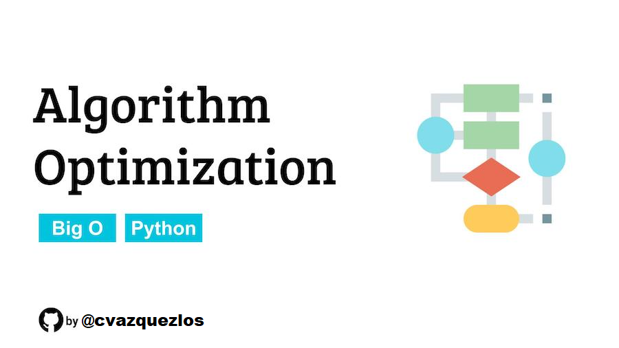

# Algorithm Optimization Project

This repository contains exercises designed to help you practice optimizing Python algorithms for better performance and readability.

## 📚 What You'll Learn

- Text processing optimization techniques
- Efficient list operations and filtering
- Using Python's built-in functions and data structures
- Code modularity and best practices
- Performance analysis and improvement strategies

## 🎯 Assignment Overview

The `problems.ipynb` notebook contains two main exercises:

1. **Text Processing Optimization** - Improve code that processes text by converting to lowercase, removing punctuation, counting word frequencies, and finding the most common words.

2. **List Processing Optimization** - Enhance code that filters even numbers, duplicates values, sums results, and checks for prime numbers.

Each exercise includes working but inefficient code that you'll optimize using better algorithms, data structures, and Python idioms.

## 🚀 Getting Started

### Option 1: GitHub Codespaces (Recommended)
1. Fork this repository to your GitHub account
2. Click the green "Code" button on your forked repository
3. Select "Codespaces" tab
4. Click "Create codespace on main"
5. Wait for the environment to load (this may take a few minutes)
6. Open `problems.ipynb` and start working!

### Option 2: Local Development
1. Fork and clone this repository
2. Create a virtual environment: `python -m venv venv`
3. Activate the virtual environment:
   - On Windows: `venv\Scripts\activate`
   - On macOS/Linux: `source venv/bin/activate`
4. Install Jupyter: `pip install jupyter`
5. Install dependencies: `pip install -r requirements.txt`
6. Launch Jupyter: `jupyter notebook`
7. Open `problems.ipynb`

## 📝 Working with the Notebook

- Each exercise contains the original inefficient code followed by optimization points
- Review the provided solutions as reference implementations
- Try implementing your own optimizations before checking the solutions
- Run each cell to test your code and compare performance

## 🎓 Learning Goals

By completing this assignment, you will:
- Understand common performance bottlenecks in Python code
- Learn to use appropriate data structures for different problems
- Practice writing clean, modular, and efficient code
- Gain experience with Python's built-in optimization tools

## 📊 Assessment

Focus on:
- **Correctness**: Does your optimized code produce the same results?
- **Efficiency**: Is your solution faster and more memory-efficient?
- **Readability**: Is your code clean and well-structured?
- **Best Practices**: Are you using appropriate Python idioms?

Happy coding! 🐍✨
